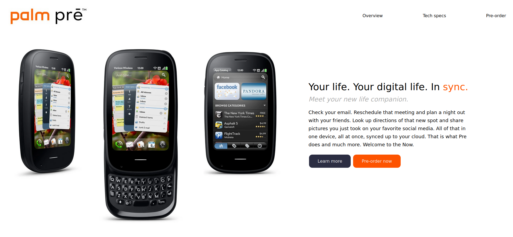

# Palm Pre Website
A personal playground for testing HTML, CSS and Javascript.

## Inspiration
I love old tech. Ever since I was a kid, I've been into consumer technology, computers... everything tech related. But I've been drawn to smartphones for a looooong time. I don't know why, I guess it's the fact that it's such a small device with a lot of power and potential and the design choices are kinda amazing (at least some years ago, when everything was not a slab of metal and glass).

So, I remember the Palm Pre. It was never available here in Panama, but I remember seeing online coverage of the phone and being very interested by it, especially by webOS. 

After some time away from web development and web design, I decided to go back to the basics and create a simple webpage and after overthinking too much, I decided on the Palm Pre. I took the concept of a single landing page from Frontend Mentor, applied it and extended it with other sections.

